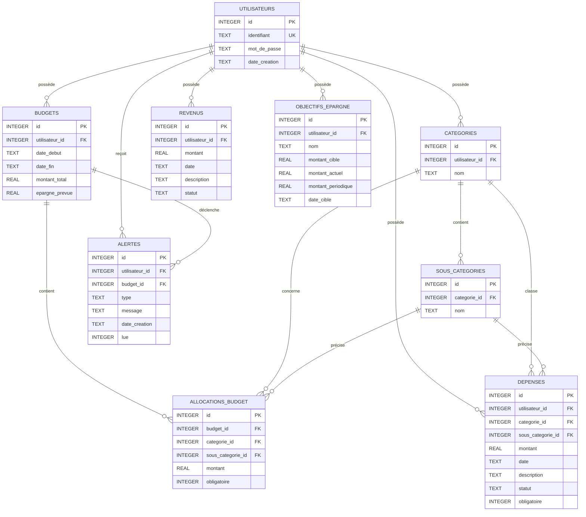

```mermaid
erDiagram

    UTILISATEURS {
        INTEGER id PK
        TEXT identifiant UK
        TEXT mot_de_passe
        TEXT date_creation
    }

    CATEGORIES {
        INTEGER id PK
        INTEGER utilisateur_id FK
        TEXT nom
    }

    SOUS_CATEGORIES {
        INTEGER id PK
        INTEGER categorie_id FK
        TEXT nom
    }

    BUDGETS {
        INTEGER id PK
        INTEGER utilisateur_id FK
        TEXT date_debut
        TEXT date_fin
        REAL montant_total
        REAL epargne_prevue
    }

    ALLOCATIONS_BUDGET {
        INTEGER id PK
        INTEGER budget_id FK
        INTEGER categorie_id FK
        INTEGER sous_categorie_id FK
        REAL montant
        INTEGER obligatoire
    }

    REVENUS {
        INTEGER id PK
        INTEGER utilisateur_id FK
        REAL montant
        TEXT date
        TEXT description
        TEXT statut
    }

    DEPENSES {
        INTEGER id PK
        INTEGER utilisateur_id FK
        INTEGER categorie_id FK
        INTEGER sous_categorie_id FK
        REAL montant
        TEXT date
        TEXT description
        TEXT statut
        INTEGER obligatoire
    }

    OBJECTIFS_EPARGNE {
        INTEGER id PK
        INTEGER utilisateur_id FK
        TEXT nom
        REAL montant_cible
        REAL montant_actuel
        REAL montant_periodique
        TEXT date_cible
    }

    ALERTES {
        INTEGER id PK
        INTEGER utilisateur_id FK
        INTEGER budget_id FK
        TEXT type
        TEXT message
        TEXT date_creation
        INTEGER lue
    }


    UTILISATEURS ||--o{ CATEGORIES : "possède"
    CATEGORIES ||--o{ SOUS_CATEGORIES : "contient"

    UTILISATEURS ||--o{ BUDGETS : "possède"
    BUDGETS ||--o{ ALLOCATIONS_BUDGET : "contient"

    CATEGORIES ||--o{ ALLOCATIONS_BUDGET : "concerne"
    SOUS_CATEGORIES ||--o{ ALLOCATIONS_BUDGET : "précise"

    UTILISATEURS ||--o{ REVENUS : "possède"

    UTILISATEURS ||--o{ DEPENSES : "possède"
    CATEGORIES ||--o{ DEPENSES : "classe"
    SOUS_CATEGORIES ||--o{ DEPENSES : "précise"

    UTILISATEURS ||--o{ OBJECTIFS_EPARGNE : "possède"

    UTILISATEURS ||--o{ ALERTES : "reçoit"
    BUDGETS ||--o{ ALERTES : "déclenche"
```
